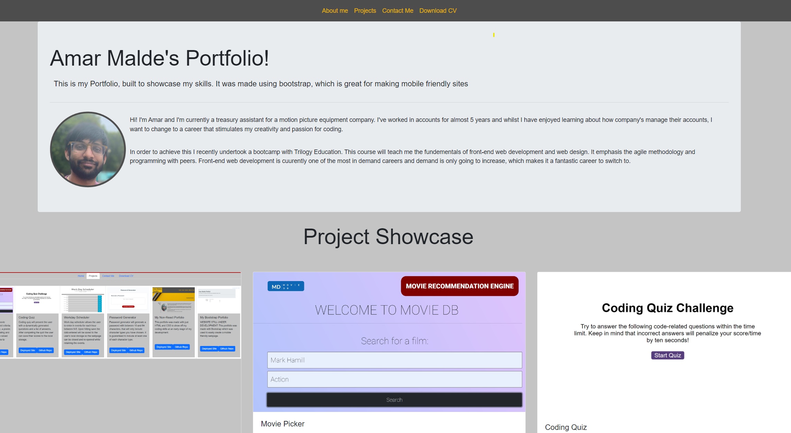

# Bootstap_Portfolio

## Description

This is my portfolio, a website designed to showcase my skills built primarly using bootstrap. Boostrap was used to easily create a mobile friendly site and I used their pre-defined css to quickly create good looking elements.

## Installation

No installation necessary! However an internet browser is required and Google Chrome is reccomended. Link to website is: https://amarmalde.github.io/Movie_DB_Project/ and it should look similar to the below image.

## Credits

Webiste primarily made using bootstrap (https://getbootstrap.com/)